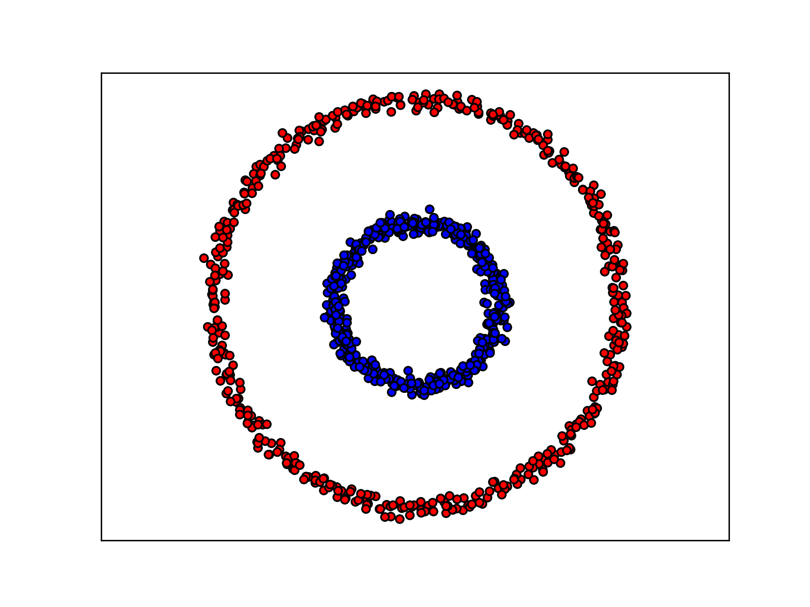
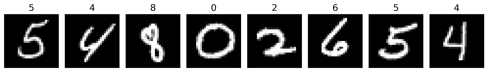

# noir-ml

Noir Circuits Library for Machine Learning

This repository provides a framework for creating noir programs for inference on multi-layer feedforward networks.

We also provide two circuit examples, one for binary classification on circles dataset, and another for multi-class classification on mnist dataset.

## Usage

The library can be used to create noir programs by either directly writing the noir code defining the network architecture, or by using the provided python script to generate the noir code from a custom trained neural network.

### 1. Writing Noir code directly

The noir code for a neural network can be written using the [`noir_ml`](noir_ml) library. The library contains the following modules:

- [`activations`](noir_ml/src/activations.nr): Contains the activation functions that can be used in the network - `relu`.
- [`layers`](noir_ml/src/layers.nr): Contains the layer definitions that can be used in the network - `fc` (fully-connected).
- [`utils`](noir_ml/src/utils.nr): Contains utility functions for field arithmetic and neural network operations - `arg_max`.

An example of a noir program for a neural network with one hidden layer and one output layer is given below:

```rust
use noir_ml::layers::{fc};
use noir_ml::activations::{relu};
use noir_ml::utils::{arg_max};

fn main(input: Field) -> Field {
    let w1 = [1, 2, 3, 4, 5, 6];
    let b1 = [1, 2, 3];
    let w2 = [1, 2, 3];
    let b2 = [1];

    let l1 = relu(fc(input, w1, b1));
    let l2 = fc(l1, w2, b2);

    arg_max(l2)
}
```

### 2. Generating Noir code from a custom trained neural network

The [`noir_code_generator.py`](noir_code_generator.py) script can be used to generate noir code for a custom trained multi-layer feedforward neural network. The script takes as input the parameters of the trained neural network, and optionally a file containing test samples, and generates the corresponding noir code along with tests ,if applicable. The script can be run using the following command:

```sh
python noir_program_generator.py --save_path src/main.nr --model_parameters model_parameters.json --test_samples test_samples.json
```

Note: The model_parameters file should be a JSON containing the neural network's weights and biases. The JSON should have keys of the form *w\{idx}* and *b\{idx}*, where *idx* is the layer number (starting from 1). The value of each key should be a flattened list of the weights/biases of the corresponding layer. For example, the following JSON is a valid model_parameters file for a neural network with 2 hidden layers and 1 output layer. It has an input dimension of 3, and an output dimension of 1.

```json
{
    "w1": [1, 2, 3, 4, 5, 6],
    "b1": [1, 2],
    "w2": [1, 2, 3, 4],
    "b2": [1, 2],
    "w3": [1, 2],
    "b3": [1]
}
```

Note: The test_samples file should be a JSON containing the test samples. The JSON should have keys of the form *input{idx}* and *output{idx}*, where *idx* is the index of the test sample (starting from 1). The value of each key should be a list of the input/output of the corresponding test sample. For example, the following JSON is a valid test_samples file for a neural network defined by the parameters in the above example.

```json
{
    "input1": [1, 2, 3],
    "output1": 0,
    "input2": [4, 5, 6],
    "output2": 1
}
```

## Example Circuits

We create a Noir program from trained neural networks for simple inference applied to two different classification problems.

### 1. Binary classification on circles dataset

#### Circles dataset

The circles dataset is a toy dataset which consists of concentric circles of 2 classes of points. The dataset is shown below:



Circles dataset - the blue points have class label 1, and the red points have class label 0
&nbsp;

#### Neural network training

We train a neural network with one hidden layer of dimension 10 and one output layer on this dataset. The neural network training code is present in the jupyter notebook [`circle_fc.ipynb`](example_circuits/circle_fc/training/circle_fc.ipynb). Once the model is trained, we save the model parameters in [`circle_fc_parameters.json`](example_circuits/circle_fc/training/circle_fc_parameters.json) and also save some test samples in [`circle_fc_samples.json`](example_circuits/circle_fc/training/circle_fc_samples.json).

#### Generating Noir program for inference

We generate the noir program for inference using the following command:

```sh
python noir_code_generator.py --save_path example_circuits/circle_fc/src/main.nr --model_parameters example_circuits/circle_fc/training/circle_fc_parameters.json --test_samples example_circuits/circle_fc/training/circle_fc_samples.json 

# Generated Noir program: example_circuits/circle_fc/src/main.nr
```

This creates the Noir program in [`main.nr`](example_circuits/circle_fc/src/main.nr).

### 2. Multi-class classification on mnist dataset

#### MNIST dataset

The MNIST dataset is a dataset of handwritten digits, 0-9. The dataset is shown below:



MNIST dataset - hadwritten digits and their corresponding labels
&nbsp;

#### Neural network training

We train a neural network with one hidden layer of dimension 10 and one output layer on this dataset. The neural network training code is present in the jupyter notebook [`mnist_fc.ipynb`](example_circuits/mnist_fc/training/mnist_fc.ipynb). Once the model is trained, we save the model parameters in [`mnist_fc_parameters.json`](example_circuits/mnist_fc/training/mnist_fc_parameters.json) and also save some test samples in [`mnist_fc_samples.json`](example_circuits/mnist_fc/training/mnist_fc_samples.json).

#### Generating Noir program for inference

We generate the noir program for inference using the following command:

```sh
python noir_code_generator.py --save_path example_circuits/mnist_fc/src/main.nr --model_parameters example_circuits/mnist_fc/training/mnist_fc_parameters.json --test_samples example_circuits/mnist_fc/training/mnist_fc_samples.json 

# Generated Noir program: example_circuits/mnist_fc/src/main.nr
```

This creates the Noir program in [`main.nr`](example_circuits/mnist_fc/src/main.nr).
